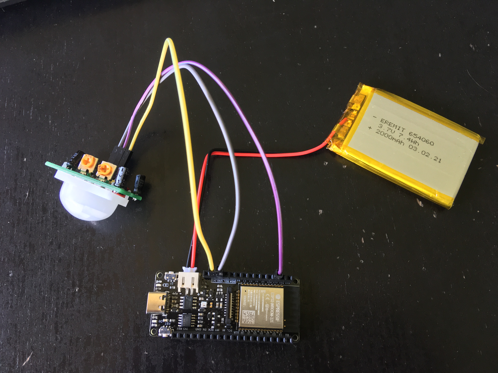

# Firebeetle-2-ESP32-E motion sensor
This project is about using the Firebeetle ESP32-E (SKU:DFR0654-F) as battery powered motion sensor

Description
-----------
A WiFi motion sensor consists of:
- Battery (here: 2000mAh LiPo battery with 3.7V nominal voltage)
- PIR sensor to detect motion (here: HC-SR501 modified to bypass the LDO so it operates at 3.3V)
- ESP32 development board (here: Firebeetle-2-ESP32-E because it can really deepsleep with low deepsleep current)

The ESP32 wakes up either by a timer or if the PIR sensor changes state. The PIR state is transmitted via WiFi and MQTT and can be used in homeautomation software for further actions. To bring the latency and power consumption down the last working Wifi channel and BSSID is cached so even after deep sleep the ESP32 quickly connects. With good signal the ESP32 is active for 450 to 1200 ms.

The choosen PIR sensor (<a href=https://www.mpja.com/download/31227sc.pdf>HC-SR501</a>) is not perfect as it consumes ~50 µA in idle state and requires soldering for 3.3V operation, but it is what I had to develop the sketch. Basically any 3.3 compatible PIR sensor can be used (for example Panasonic PaPIRs consume less current).
