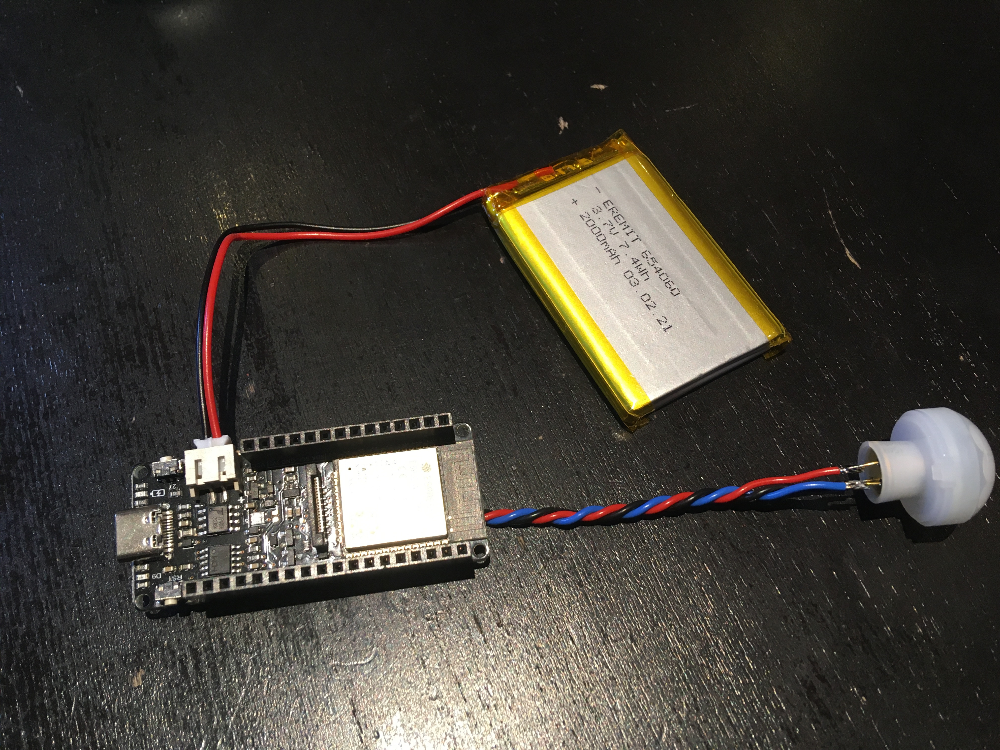

# Firebeetle-2-ESP32-E motion sensor
This project is about using the Firebeetle ESP32-E (SKU:DFR0654-F) as battery powered motion sensor

Description
===========
This WiFi motion sensor consists of:
- LiPo-Battery (<a href="https://www.eremit.de/p/eremit-3-7v-2000mah-lipo-akku-654060-jst-ph-2-0mm">2000mAh</a> LiPo battery with 3.7V nominal voltage and protection circuits)
- PIR sensor to detect motion (Panasonic Series WL EKMB1303111K, <a href="https://mediap.industry.panasonic.eu/assets/download-files/import/ca_pir_motionsensors_1192_en.pdf">Datasheet</a>, 6µA current consumption)
- ESP32 development board with LiPo charging circuit (<a href="https://wiki.dfrobot.com/FireBeetle_Board_ESP32_E_SKU_DFR0654">Firebeetle-2-ESP32-E</a> because it can really deepsleep with low deepsleep current)

Mainly the ESP32 saves power by entering DeepSleep state. In this state it draws about 23 µA if the "LowPower-Pad" to the RGB-color-LED is cut. Two events cause the ESP32 to wake up:
- either a timer, or if
- the PIR sensor changes state.

The PIR state is transmitted via WiFi/MQTT and can be used in homeautomation software for further actions.

Powersaving
===========
Cache WiFi channel and BSSID/MAC
--------------------------------
To bring the latency and energy-consumption down, Wifi channel and BSSID are cached in the RTC-RAM-section of the ESP. These cached values are still available even if the ESP32 wakes up from deep sleep. With good signal, the ESP32 is active for 450 to 1200 ms if the cached values still work. If the cached values do not work, the ESP32 performs a scan of all channels, authenticates and associates to the strongest Accesspoint found. This consumes a lot more time and thus energy, because the ESP32 needs to check all channels and see if it catches beacons of matching Accesspoints. It depends a lot on the accesspoints if the connections is quick and energy conserving or slow.

PIR sensor
----------
The PIR sensor EKMB1303111K is a 3.3V type sensor with low power consumption and a reasonable price (<a href="https://mediap.industry.panasonic.eu/assets/download-files/import/ca_pir_motionsensors_1192_en.pdf">Panasonic PaPIR</a>).

Battery protection
==================
Battery itself
--------------
LiPo-batteries need protection against overvoltage, short circuit and undervoltage/deep-discharge. Without these safety measures, they do not last long and can swell or even burn. The LiPo should have the proper connectors (PH2.0) with the correct polarity and sourced from a trustworthy supplier. The LiPo-battery as used has a <a href="https://cdn.sparkfun.com/assets/learn_tutorials/2/5/1/DW01-P_DataSheet_V10.pdf">DW01</a> protection IC. It shuts-down below 2.4V and above 4.25V. 

Deep-discharge protection
-------------------------
Besides those safety measures build into the LiPo-battery, the sketch measures the battery voltage. To obtain accurate voltages, the sketch uses factory calibration values. Espressif either sets two-point, one-point or no calibration value to the EFUSE-area.
If the voltage is below 3.2V, the sketch stops its regular work and enters deep-sleep for ten minute intervals. If put on a charger the device automatically enters the regular operation mode again within those ~10 minutes. If the battery drops to 3.1 to 3.0 V the sleep interval is longer with 60 minutes. If the voltage drops below 3.0V the device enters a hibernate-mode and a manual push of the reset-button is required. The voltage drops quite steeply below 3.3V and not many Ampere-hours are wasted with these levels.
